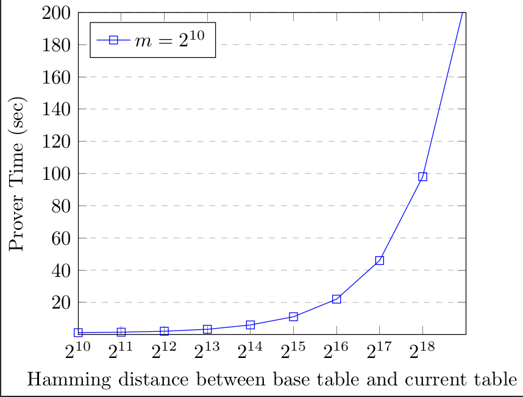

# Batching Efficient RAM From Updatable Lookup Arguments
This repository contains implementation of lookup arguments from updatable tables, detailed in the paper 
"Batching Efficient RAM Using Updatable Lookup Arguments" [paper](https://eprint.iacr.org/2024/840.pdf) appearing 
in ACM CCS 2024. 

WARNING:  This project contains a proof of concept implementation of the above paper and has not received any formal audit.  It should not be used production.
n this project.

The repository is a fork of the original implementation of Caulk [caulk](https://eprint.iacr.org/2022/621) 
sub-vector lookup argument available at [caulk-crypto](https://github.com/caulk-crypto/caulk). We re-use 
many components such proof transcripts and algebraic algorithms from the Caulk implementation. 

The remainder of the document gives a tutorial introduction to the code, and how to run and reproduce some 
of the benchmarks reported in the paper. 

## Code Overview
The changes corresponding to the updatable lookup tables appear in the `updatable-ram` branch of the repo. 

- Several new algebraic algorithms for polynomial interpolation and evaluation are added to `src/single/dft.rs`
on top of the existing algorithms from the Caulk repository.
- Implementation of CQ lookup protocol based on the paper [CQ](https://eprint.iacr.org/2022/1763), with additional option of computing CQ lookup argument using 
pre-processed parameters for an "approximate" table. This code appears in the file `src/ramlookup/cq.rs`. 
- A fast $O(\delta\log^2 \delta)$ algorithm for computing scalar coefficients for computing the additive encoded quotient on 
top of the base CQ cached quotient. This appears in `src/ramlookup/fastupdate.rs`.
- An implementation of polynomial protocol for memory consistency appears in `src/ramlookup/mod.rs`. Currently, 
the protocols for checking well formation of time ordered transcript and address ordered transcript are implemented. 
We hope to implement remaining protocols in the future, but they are not critical to overall benchmarks, as these are 
over much smaller tables.

## Preparation
These instructions have been tested on recent Ubuntu Linux Distributions.

- Install curl if not already installed. On most Ubuntu Systems it might only take the following:
```shell
sudo apt install curl
```

- Install rust if not installed. On Ubuntu based Linux distributions, this may be done via the following command:
```shell
 curl --proto '=https' --tlsv1.2 -sSf https://sh.rustup.rs | sh -s -- --default-toolchain none -y
```

- Restart the terminal and install cargo.
```shell
rustup default stable
```
- Unpack the project archive in a suitable directory. In the project root directory, create folders for storing `srs` and table parameters.
```shell
mkdir -p ./srs ./polys_cq
```

- Generate SRS and CQ public parameters. This generates SRS and commitments to certain polynomials independent of the table. The following command from the project root directory generates 
the required parameters in the subdirectory `poly_cq` for several table sizes. This step can take approximately 30 minutes.

```shell
~/.cargo/bin/cargo test --release --package caulk --lib ramlookup::cq::tests::test_setup -- --exact --nocapture 
```

## Running Benchmarks for CQ Argument from Updatable Tables

### Benchmarking Offline Phase
Offline phase consists of pre-processing a table, denoted as `base_table` and computing encoded quotients corresponding to it. More formally, for a table
given by polynomial $T(X)$, we compute quotients $W_i = [(T(X) - T(\xi^i))/(X-\xi^i)]_1$ for all $i\in [N]$. For this, we use the $O(N\log N)$ time algorithm of Fiest and Khoratovic 
described in [Fast KZG Proofs](https://eprint.iacr.org/2023/033). This step can take close to 3 hours for table size of 1 million. The benchmark can be executed using:

```shell
~/.cargo/bin/cargo test --release --package caulk --lib ramlookup::cq::tests::test_cq_table_params -- --exact --nocapture
```
The above command runs the offline parameter generation for table of size `1 << h_domain_size` and the parameters are stored under the `polys_cq` directory. The parameters are generated for
the table given by the vector $(0,1,\ldots,N-1)$. The stored parameters can be used for subsequent benchmarks. The parameter `h_domain_size` can be modified in the test module in the file `src/ramlookup/cq.rs`.

```rust 
mod tests {
    use std::time::Instant;
    use ark_bls12_381::Bls12_381;
    use super::*;

    const h_domain_size: usize = 20;
    const m_domain_size: usize = 10;
    const k_domain_size: usize = 18;
    // ...
}
```
The following is the summary of offline phase when run on different table sizes on a Ubuntu Linux 22.04 platform with Intel® Core™ i5-9400F CPU @ 2.90GHz.

| Table Size | Offline Preprocessing Time (s) |
|:---------:| :-----------------------------: |
|  $2^{10}$ | 7 |
|  $2^{12}$ | 29 | 
 | $2^{14}$ | 135 |
 | $2^{16}$ | 620 |
  | $2^{18}$ | 2766 |
| $2^{20}$ | 12000 |


### Benchmarking Online Phase
This scenario considers two tables, which we call `base_table`, for which we have pre-computed cached quotients (as in the CQ protocol), and `current_table`
which differs from the `base_table` at some $K$ locations. Moreover, we consider a sub-vector `f_vec` of `current_table` of size $m$. The example here 
constructs an argument for showing `f_vec` is a sub-vector of `current_table`. This example runs the following workflow:
- Generate a random `base_table` of size `N = 1 << h_domain_size`.
- Generate encoded quotients for the `base_table`. To make testing online phase faster, we generate table parameters by using the SRS trapdoor, instead of SRS. This is just meant for testing, in practice,
the SRS trapdoor is not available to any party for this computation. Nevertheless, generating parameters for a table of size 1 million may still take close to 5 minutes.
- Generate a `current_table`, which differs from the `base_table` in at most `K = 1 << k_domain_size` positions. 
- Sample a sub-vector `f_vec` of `current_table` of size at most `m = 1 << m_domain_size`.
- Generate a proof showing `f_vec` is a sub-vector of `current_table` using parameters generated for `base_table`. This uses base + cache approach described in Section 7.2 of the [paper](https://eprint.iacr.org/2024/840.pdf).
- Verify the above proof. 

To run this example one executes the following command from the repository root directory (the one containing `Cargo.toml`). 

```shell
~/.cargo/bin/cargo test --color=always --release --package caulk --lib ramlookup::cq::tests::test_run_full_protocol -- --exact --nocapture
```
The above command assumes cargo is installed in the user's home directory. It should be changed appropriately to point to the rust installation. The above command runs the test function 
`test_run_full_protocol` in the file `src/ramlookup/cq.rs`. The test can be run for different parameters by changing the following constants in the test module in the same file.

```rust 
mod tests {
    use std::time::Instant;
    use ark_bls12_381::Bls12_381;
    use super::*;

    const h_domain_size: usize = 20;
    const m_domain_size: usize = 10;
    const k_domain_size: usize = 18;
    // ...
}
```
Here `N=1 << h_domain_size` gives the size of the tables, `m=1 << m_domain_size` gives the size of the sub-vector while `K=1 << k_domain_size` gives the maximum hamming distance between the base table 
and the current table. Note that the above example does not store the table specific parameters for subsequent tests. Since generating parameters for a table is time-consuming, to run several benchmarks
on a table, we support set of benchmarks on fixed base tables of various sizes, whose parameters can be stored. We discuss these below.

### Benchmarking Online Phase using Pre-Processed Tables
Whenever the test function 
```shell
~/.cargo/bin/cargo test --release --package caulk --lib ramlookup::cq::tests::test_cq_table_params -- --exact --nocapture
```
is executed, pre-processed parameters for the table $(0,1,\ldots,N-1)$ are generated and stored under `poly_cq` directory. These tables may be used to benchmark proof generation from 
approximate tables by running the test:
```rust
~/.cargo/bin/cargo test --release --package caulk --lib ramlookup::cq::tests::test_compute_cq_proof -- --exact --nocapture
```
Once again, one sets the parameters `h_domain_size, m_domain_size` and `k_domain_size` for obtaining different benchmarks. This test uses a base table in `polys_cq` directory corresponding to the size
parameter `h_domain_size`. 

We expect to see the following performance profile for the online phase for a table size of 1 million, where the x-axis 
denotes the hamming distance of the table for which sub-vector argument is generated from the pre-processed table.


